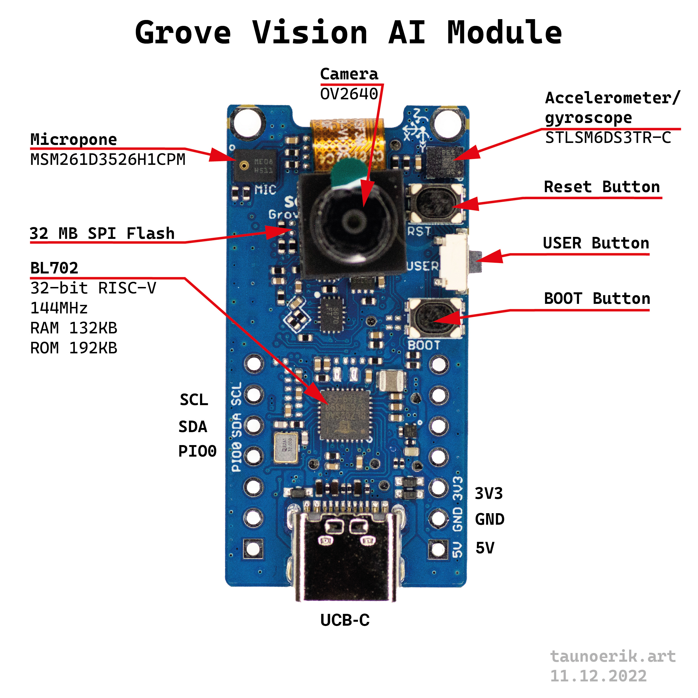
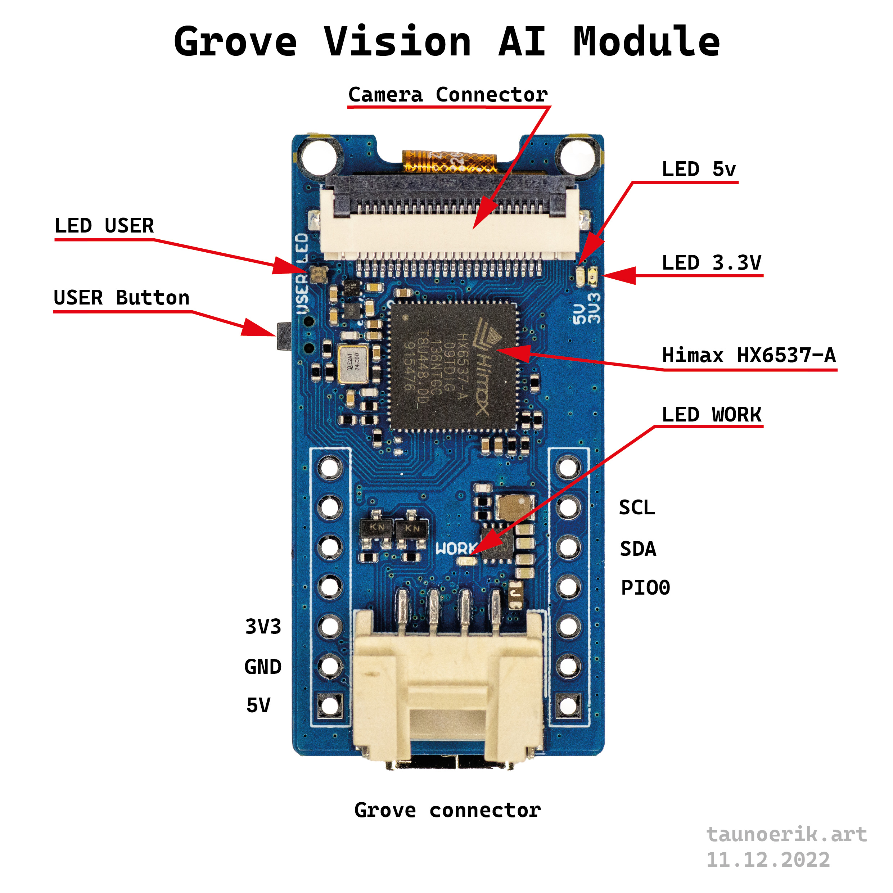
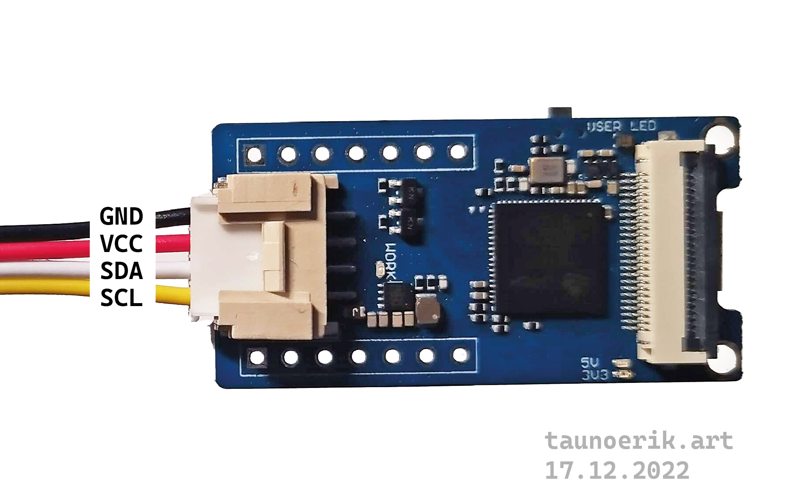

# Grove Vision AI Module

## What it is

Grove Vision AI Module contains a camera (OV2640) and two microcontrollers.

- **Himax HX6537-A** is an ultra-low-power, high-performance microcontroller designed for battery-powered TinyML applications.
- **BL702** 32-bit RISC CPU. BL702 is the USB-UART chip which enables the communication between the PC and the Himax chip.

In addition, there are two sensors:

- Micropone MSM261D3526H1CPM
- 3D Accelerometer and gyroscope,  6-axis Inertial Measurement Unit (IMU)

Dual 7-pin headers are compatible XIAO series boards.

Operating Voltage 5v.

Baud rate 115200.

I2C interface.

The camera supports resolution up to 1600x1200 px but is set to 192x192 px due to the limitation of inference speed.

It is not open source product. [Link](https://forum.seeedstudio.com/t/possibility-on-writing-custom-firmware-for-grove-vision-ai-module/266540/6)

## Update BL702 chip firmware

[Edge Impulse: Update BL702 chip firmware](https://docs.edgeimpulse.com/docs/development-platforms/officially-supported-mcu-targets/seeed-grove-vision-ai#1.-update-bl702-chip-firmware)

## Build Models

- [Ultralytics YOLOv5](https://ultralytics.com/yolov5)
- Github: [YOLOV5-SWIFT](https://github.com/Seeed-Studio/yolov5-swift) for AIoT hardware devices launched by Seeed
- Tutorial [Train and Deploy Your Own AI Model Into Grove - Vision AI](https://wiki.seeedstudio.com/Train-Deploy-AI-Model/)
- Tutorial [Train and Deploy Your Own AI Model Into SenseCAP A1101 & Grove - Vision AI](https://wiki.seeedstudio.com/Train-Deploy-AI-Model-A1101-Grove-Vision-AI/)
- [HIMAX Yolo-Fastest Person Detection Example For Seeed Grove Vision AI Module](https://github.com/HimaxSmartSensing/WE_I_Plus_User_Examples/tree/main/HIMAX_Yolo_Fastest_Person_Detection_Example_For_Grove_AI)

## Upload models to the camera

The trained models are in the file `.uf2`

1. Connect the USB-C cable and double-click the BOOT button. GROVEAI will be mounted as a drive.

## Arduino lib

- [github.com/limengdu/Seeed-Grove-Vision-AI-Moudle](https://github.com/limengdu/Seeed-Grove-Vision-AI-Moudle)
- [github.com/Seeed-Studio/Seeed_Arduino_GroveAI](https://github.com/Seeed-Studio/Seeed_Arduino_GroveAI)

## Datasheets

- [Himax HX6537-A](datasheets/Himax_HX6537-A09TDIG-1111V_Datasheet.pdf) pdf

## Web interface

- Web interface: [taunoe.github.io/grove-ai-vision/](https://taunoe.github.io/grove-ai-vision/)
- Instructions: [github.com/taunoe/grove-ai-vision](https://github.com/taunoe/grove-ai-vision)

## Linux

Linux may not recognize it as a USB device. Therefore we need to create new rules file. File name: `60-visionai.rules`

File content:

`SUBSYSTEM=="usb", ATTRS{idVendor}=="2886", ATTRS{idProduct}=="8060", MODE="0666"`

Save the new rules file to the /etc/udev/rules.d/ directory.

Restart the udev rules:

`sudo udevadm control --reload-rules`

## EdgeLab

- [github.com/Seeed-Studio/EdgeLab](https://github.com/Seeed-Studio/EdgeLab)
- [github.com/Seeed-Studio/edgelab-model-zoo](https://github.com/Seeed-Studio/edgelab-model-zoo)
- [github.com/Seeed-Studio/edgelab-example-vision-ai](https://github.com/Seeed-Studio/edgelab-example-vision-ai)

## Links

- [Edge Impulse Seeed Grove Vision Ai](https://docs.edgeimpulse.com/docs/development-platforms/officially-supported-mcu-targets/seeed-grove-vision-ai)
- [Grove - Vision AI Module](https://www.seeedstudio.com/Grove-Vision-AI-Module-p-5457.html)
- [Grove-Vision-AI-Module](https://wiki.seeedstudio.com/Grove-Vision-AI-Module/) wiki
- [TinyML Package Monitor](https://www.hackster.io/hendra/tinyml-package-monitor-ef4710) Hackster.io
- [VisionAI Automatic Dog Treat Dispenser /wRoboflow and YOLOv5](https://www.hackster.io/satoshiii/visionai-automatic-dog-treat-dispenser-wroboflow-and-yolov5-a71fd2) Hackster.io
- [Smart Luffa Farming with LoRaWAN](https://www.hackster.io/meilily-li/smart-luffa-farming-with-lorawan-b705b0) Hackster.io
- [hackster.io/wesee/bird-watcher-with-camera-trap-2cb71f](https://www.hackster.io/wesee/bird-watcher-with-camera-trap-2cb71f)
- [hackster.io/kutluhan-aktar/iot-ai-driven-tree-disease-identifier-w-edge-impulse-mms-1b5ff6](https://www.hackster.io/kutluhan-aktar/iot-ai-driven-tree-disease-identifier-w-edge-impulse-mms-1b5ff6)
___
Tauno Erik 2022-2023
